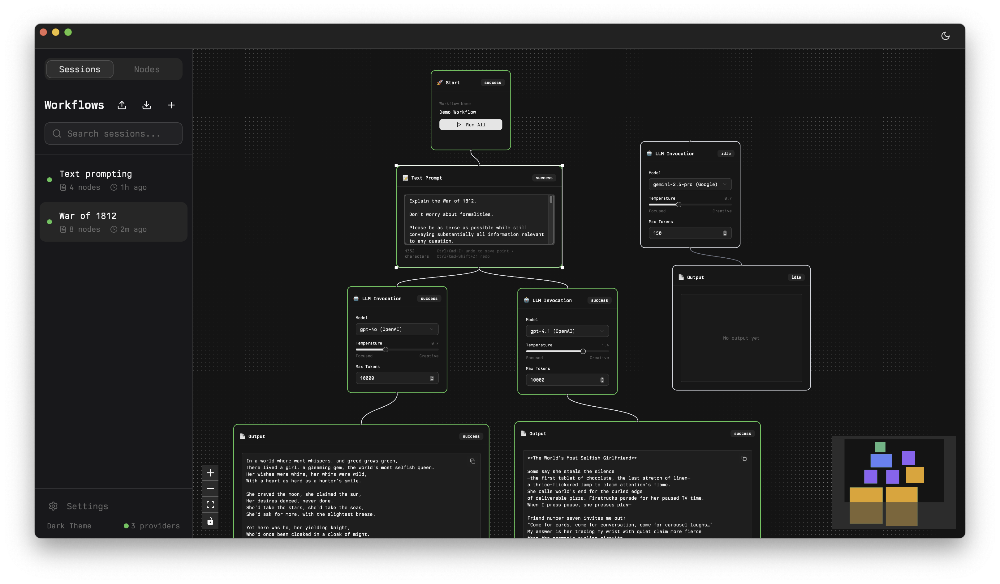

<div align="center">
  
</div>

<div align="center">
  <h3>Loki</h3>
  <p>Transform traditional linear chat interfaces into an interactive graph-based canvas for LLM interactions</p>
</div>

<div align="center">
  
</div>

## About

Loki replaces the traditional linear chat interface for Large Language Models (LLMs) with an interactive **graph-based canvas**. By representing prompts, context, and outputs as nodes and edges, advanced workflows such as parallel invocations, branching, and time-travel become intuitive and visual.

### Why Loki?

- **Visual Workflow Design**: Create complex AI workflows using drag-and-drop nodes
- **Parallel Execution**: Run multiple LLM calls simultaneously and compare results
- **Branching & Time-Travel**: Explore different conversation paths without losing history
- **Multi-Model Support**: Work with various LLM providers in a single workspace
- **Desktop Performance**: Built with Tauri for fast, lightweight desktop experience

## Key Features

- 🎨 **Graph Canvas** – Intuitive node-based workflow editor powered by React Flow
- 🤖 **LLM Integration** – Support for OpenAI, Anthropic, and other providers via AI SDK
- ⚡ **Parallel Processing** – Execute multiple nodes concurrently with real-time status
- 🕰️ **Session Management** – Save, load, and organize your AI workflows
- 🎯 **Smart Execution** – Automatic dependency resolution and streaming responses
- 🎨 **Modern UI** – Beautiful interface with light/dark theme support

## Getting Started

### Prerequisites

- [Rust](https://rustup.rs/) (latest stable)
- [Node.js](https://nodejs.org/) (18 or higher)
- [Bun](https://bun.sh/) (package manager)

### Local Development

1. **Clone the repository**

   ```bash
   git clone https://github.com/your-username/loki.git
   cd loki
   ```

2. **Install dependencies**

   ```bash
   bun install
   ```

3. **Set up your environment**

   Create a `.env.local` file in the root directory and add your API keys:

   ```env
   OPENAI_API_KEY=your_openai_api_key_here
   # Add other provider keys as needed
   ```

4. **Start the development server**

   ```bash
   bun run dev
   ```

   This will start both the Vite frontend and Tauri backend in development mode.

### Building for Production

```bash
# Build the application
bun run build

# Build and package for your platform
bun run tauri build
```

## Download & Installation

_Pre-built binaries will be available soon via GitHub Releases with automated CI/CD._

**Planned Platforms:**

- 🍎 macOS (.dmg)
- 🪟 Windows (.exe)
- 🐧 Linux (AppImage)

## Tech Stack

- **Frontend**: React 18 + TypeScript + Vite
- **Canvas**: React Flow (@xyflow/react) for node-based interface
- **State Management**: Zustand with modular slice architecture
- **UI Components**: Tailwind CSS + shadcn/ui
- **Desktop Framework**: Tauri (Rust + WebView)
- **AI Integration**: Vercel AI SDK with OpenAI support

## Project Structure

```
loki/
├── src/                    # React frontend
│   ├── components/         # UI components and node definitions
│   ├── lib/store/         # Zustand store with modular slices
│   ├── pages/             # Route-level components
│   └── hooks/             # Custom React hooks
├── src-tauri/             # Rust backend
│   ├── src/               # Tauri commands and Rust logic
│   └── icons/             # Application icons
└── docs/                  # Documentation and plans
```

## Roadmap

- [x] Core node-based canvas with React Flow
- [x] LLM integration with streaming support
- [x] Session management and persistence
- [x] Theme system and modern UI
- [ ] Plugin system for custom nodes
- [ ] Real-time collaboration features
- [ ] Cloud sync and sharing
- [ ] Advanced metrics and analytics

## License

This project is licensed under the MIT License - see the [LICENSE](LICENSE) file for details.

## Acknowledgments

- Built with [Tauri](https://tauri.app/) for cross-platform desktop development
- Powered by [React Flow](https://reactflow.dev/) for the node-based interface
- UI components from [shadcn/ui](https://ui.shadcn.com/)
- AI integration via [Vercel AI SDK](https://sdk.vercel.ai/)
