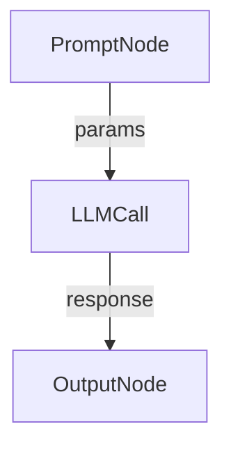

# Loki – Product Requirements Document (PRD)

## 1. Purpose

Loki is a desktop application that replaces the traditional linear chat interface for Large Language Models (LLMs) with an interactive **graph-based canvas**. By representing prompts, context, and outputs as nodes and edges, advanced workflows such as parallel invocations, branching, and time-travel become intuitive and visual.

The app is built with **Tauri** (Rust backend + WebView frontend) and **React + TypeScript**. The canvas is powered by **React Flow (@xyflow/react)**, and global state is managed with **Zustand**. LLM calls can be executed via JavaScript SDKs (e.g. Vercel AI, OpenAI) or directly from Rust for maximal performance and multi-model flexibility.

## 2. Goals

1. Provide an intuitive visual interface for composing, executing, and iterating on LLM prompts.
2. Support advanced capabilities out-of-the-box:
   • Multiple / parallel prompt executions in a single view  
   • Branching & time-travel (revisiting previous states without losing history)  
   • Easy comparison of different prompt versions / models
3. Deliver a cross-platform desktop experience with small bundle size (< 30 MB) and fast startup (< 1 s cold start).

## 3. Non-Goals

• Web (browser-only) deployment – focus is desktop first.  
• Built-in team collaboration / sync.  
• Managing billing for LLM usage.

## 4. User Personas

| Persona                   | Needs                                          | Pain Points Today                            |
| ------------------------- | ---------------------------------------------- | -------------------------------------------- |
| Prompt Engineer           | Rapidly iterate on prompt chains & parameters  | Linear chat UIs are slow to branch & compare |
| AI-Enthusiast / Developer | Experiment with multiple models & tools        | Copy-pasting between tools is error-prone    |
| Data Scientist            | Visualise prompt pipelines for reproducibility | Difficult to reproduce long chat threads     |

## 5. Core Features (MVP)

1. **Graph Canvas** – drag-and-drop node system using React Flow.
2. **Node Types**  
   • Text Prompt Node  
   • LLM Invocation Node (select model, temperature, etc.)  
   • Output / Viewer Node (shows response)  
   • Utility Nodes (Join, Split, Delay) – stretch goal.
3. **Parallel Execution** – execute multiple nodes concurrently, display status/spinners.
4. **Time-Travel History** – persist immutable snapshots; allow reverting/branching.
5. **Multi-Canvas Workspace** – sidebar to create, rename, delete canvases.
6. **LLM Integration Layer** – abstraction supporting:  
   • Vercel AI SDK (Edge)  
   • Direct OpenAI / Anthropic JS SDKs  
   • Optional Rust-side fetch via reqwest for offline/CLI modes.
7. **Local Persistence** – store canvases & history using Tauri's file APIs (JSON) or SQLite.
8. **Theming & UX Polish** – light/dark mode, keyboard shortcuts, undo/redo.

## 6. Nice-to-Have / Future

• Real-time collaboration via WebRTC / CRDTs.  
• Plugin system for custom nodes.  
• Metrics panel (token usage, cost estimation).  
• Cloud sync & shareable links.

## 7. Technical Requirements

### 7.1 Frontend

• React 18, TypeScript, Vite.  
• React Flow (@xyflow/react).  
• Zustand for global state (`useStore`).  
• Tailwind CSS + Shadcn UI for components.  
• Strict ESLint & Prettier configs.

### 7.2 Backend (Tauri / Rust)

• Commands exposed via `tauri::command` for filesystem & network (LLM calls).  
• Rust side optional: streaming responses over IPC channels.  
• Follow Tauri security best practices (CSP, isolation).

### 7.3 LLM Abstraction



Implementation detail: JavaScript first (Vercel AI) with a switchable strategy pattern; Rust fallback.

### 7.4 State Shape (Zustand)

```ts
export interface CanvasState {
  canvases: Record<string, Canvas>; // id -> data
  activeCanvasId: string;
  setCanvases: (c: Record<string, Canvas>) => void;
}
```

Persist using `createJSONStorage` + Tauri FS.

## 8. Roadmap

### Phase 0 – Project Bootstrap

• Repo scaffolding (done)  
• Continuous integration & linting  
• Tailwind & Shadcn UI setup

### Phase 1 – Canvas & Basic Nodes

• Implement core React Flow canvas wrapper  
• Create Text Prompt node & basic LLM Invocation node  
• Execute LLM calls and stream output to Output node

### Phase 2 – Multi-Canvas & Persistence

• Build sidebar UI to create/rename/delete canvases
• Establish Zustand store structure  
• Implement local save/load via Tauri FS

### Phase 3 – Parallel Execution & Time-Travel

• Enable concurrent node execution with status indicators  
• Design snapshot history model (immutable)  
• Implement branch & revert UI interactions

### Phase 4 – Polish & Packaging

• Add dark/light theme toggle & keyboard shortcuts  
• Optimize bundle & package installers (.dmg, .exe, AppImage)  
• Prepare release notes and documentation

## 11. Open Questions

1. Which models must be supported by default?
2. Streaming vs batch responses – how to display streams in graph UI?
3. Persist snapshots as diffs or full copies?
4. Team collaboration scope & timeline.
